# HiFi-ANOVA — a worked example on the heteroscedastic Ishigami function

*A visual tour of what the toolbox produces from one fit: the dual mean+variance
sensitivity spectrum, the learned effects, the regularization trade-offs, and how
the fit holds up under noise.*

> There is also a standalone [HTML version](ishigami_showcase.html) of this page
> (light/dark, same content).

The **Ishigami function** is a classic sensitivity-analysis benchmark. We use a
**heteroscedastic** variant — the response is noisy, and the noise level itself
depends on an input — because it exercises every part of the toolbox at once.

> **f(x) = sin(x₁) + 7·sin²(x₂) + 0.1·x₃⁴·sin(x₁)**,  xᵢ ~ U(−π, π),
> with Gaussian noise whose std ramps **0.3 → 3.0** across x₃.

**Why this example is instructive — two things about x₃:**

- It has **zero first-order effect** on the mean (it acts only through the x₁–x₃
  interaction) but a **non-zero total-order** effect. A method that reports a
  first-order importance for x₃ is picking up noise.
- It is a **hidden variance driver**: it carries no mean signal yet controls the
  entire noise variance — invisible to ordinary feature importance.

Analytic ground-truth first-order Sobol indices: **x₁ = 0.314, x₂ = 0.442,
x₃ = 0.000**; x₃ total-order = 0.244.

Everything below is produced by `python examples/run_ishigami_heteroscedastic.py`
(7 000-point fit; all figures land in `figures/`).

---

## 1. The dual Sobol spectrum — mean vs variance sensitivity

Because the fit is linear in the basis coefficients, sensitivity indices for both
the conditional **mean** and the conditional **variance** are read directly off a
single solve — one pair of numbers per variable.

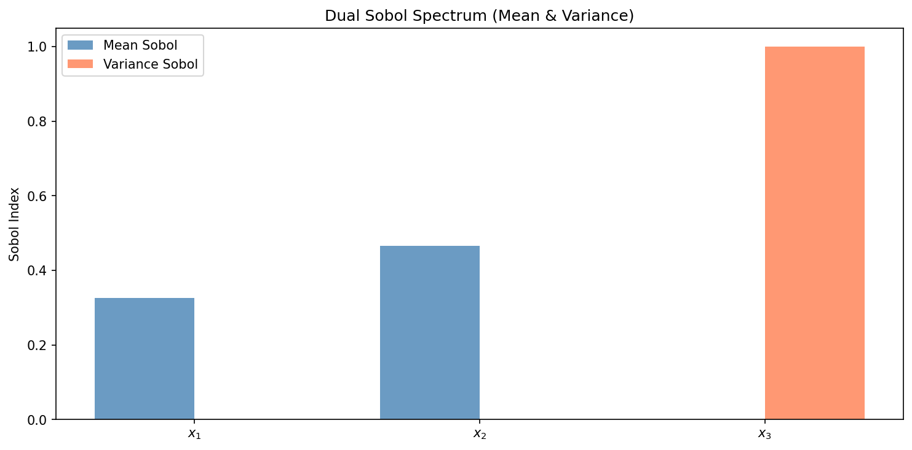

*Blue = effect on the mean E[y|x], red = effect on the variance Var[y|x]. x₁/x₂
drive the mean; **x₃ drives the variance** (Sʰ ≈ 1) while contributing almost
nothing to the mean — the hidden-driver signature.*

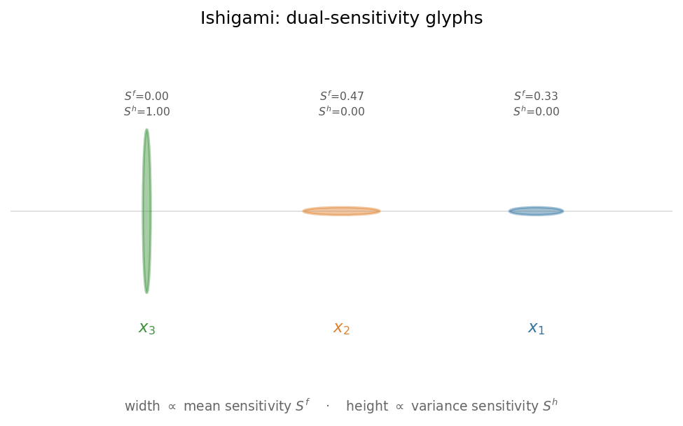

*Ellipse glyphs — each variable is one ellipse: **width ∝ mean sensitivity**,
**height ∝ variance sensitivity**. x₁/x₂ are wide and flat (mean drivers); x₃ is
tall and narrow (variance driver). The shape tells the story at a glance.*

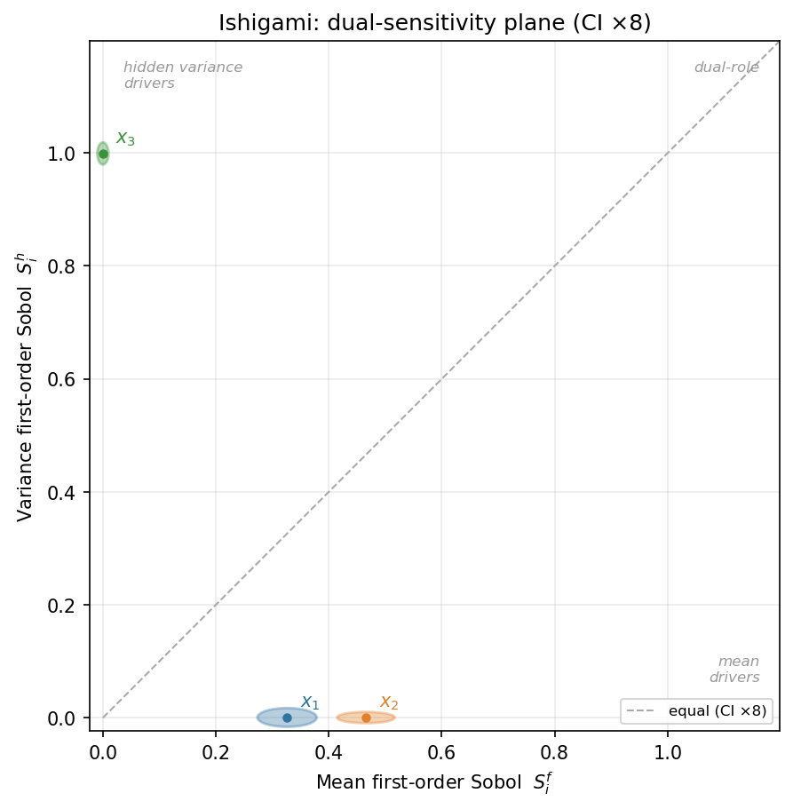

*Dual-sensitivity plane — each variable sits at (mean Sobol, variance Sobol); the
ellipse is its bootstrap confidence region. x₃ lands top-left (hidden variance
driver), x₁/x₂ bottom-right (mean drivers).*

---

## 2. The learned first-order effects

The fitted one-dimensional effect of each variable, in quantile space.

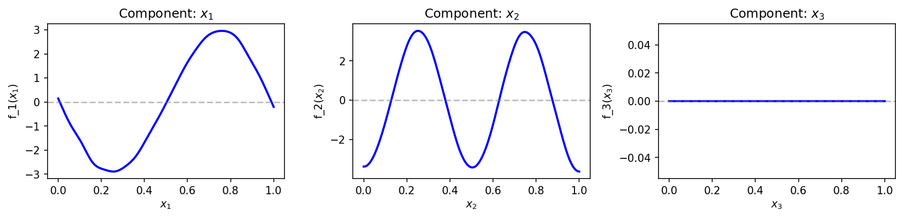

*x₁ recovers a sine, x₂ a squared-sine (two humps). **x₃ is exactly flat** — its
spurious main-effect block was removed by `first_order_pruning='bic'`, a group
test that zeros an entire first-order block when the data does not support it.
Plain ridge can only shrink such a block; it can never set it to zero.*

---

## 3. Regularization — choosing and understanding the penalty

Every quantity below comes from a single ridge factorization, so an entire
regularization path is essentially free — no retraining.

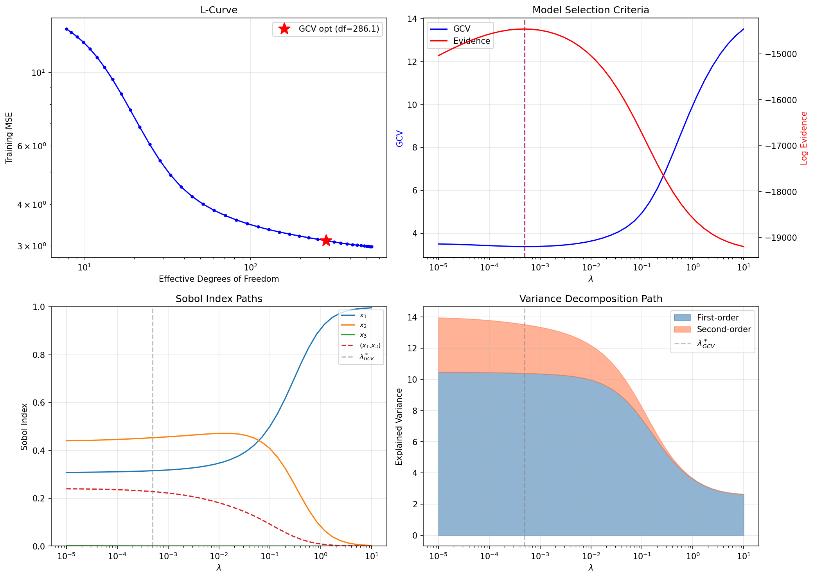

*Clockwise: the L-curve (fit vs complexity) with the GCV optimum starred; GCV &
evidence agreeing on λ; the Sobol indices at every λ (note x₃ pinned at zero
throughout); and the explained-variance decomposition by interaction order.*

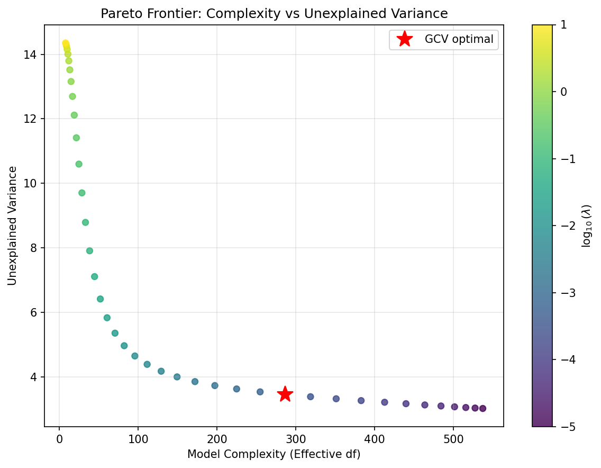

*Pareto frontier — unexplained variance vs model complexity (effective degrees of
freedom), colored by λ. The GCV optimum sits at the elbow, where extra complexity
stops buying accuracy.*

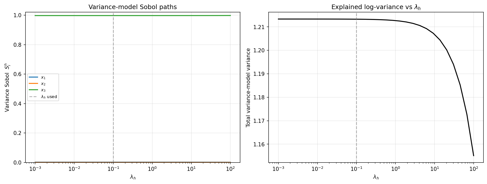

*Variance-model path — the same idea for the *variance* model: sweep the variance
penalty λₕ. x₃ dominates the variance spectrum across the whole range — a robust
conclusion, not an artifact of one penalty.*

---

## 4. How good is the fit — under noise?

With heteroscedastic noise, a prediction-vs-observation plot *cannot* collapse to a
line: its scatter is the irreducible noise. Because the data is synthetic we also
know the noiseless truth, so we can separate **mean recovery** from **noise**.

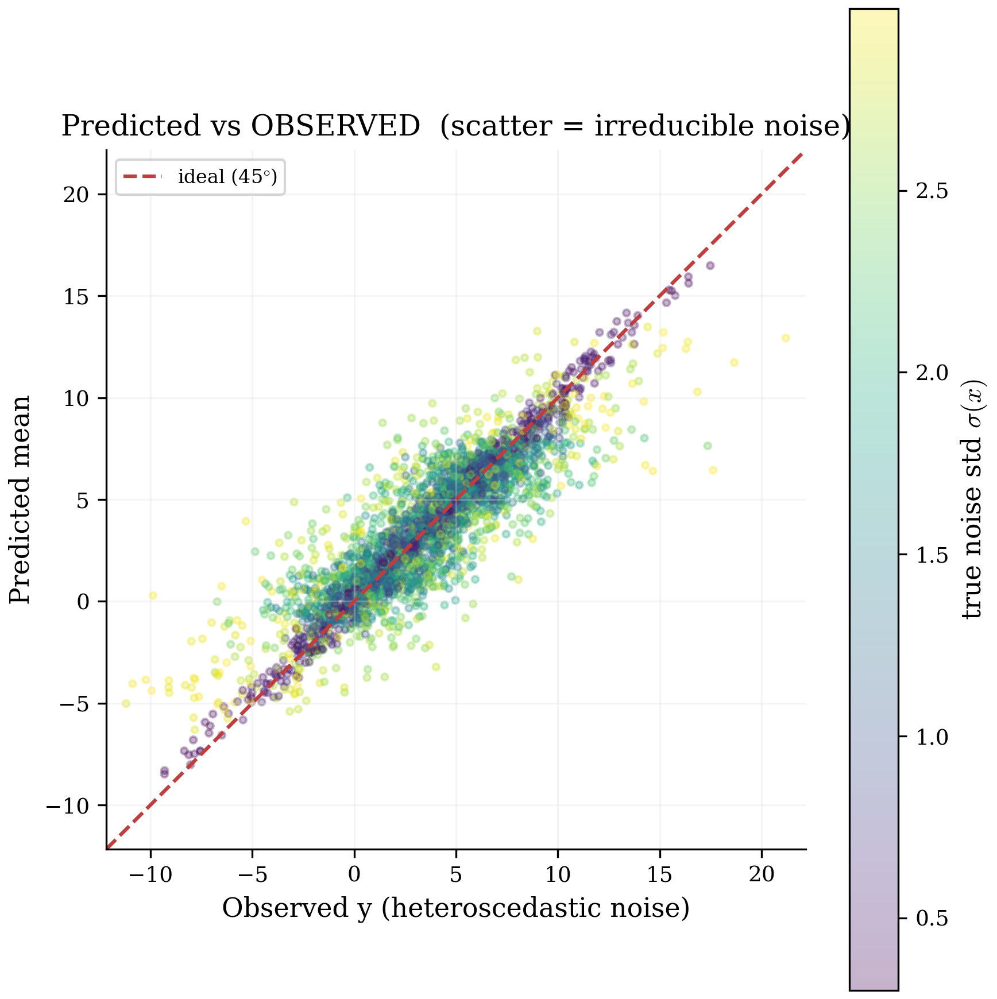

*Predicted vs observed y — points colored by the true noise std σ(x). R² = 0.79 —
*at the noise ceiling, not a weak fit*. The points that stray farthest are exactly
the high-noise (yellow) ones.*

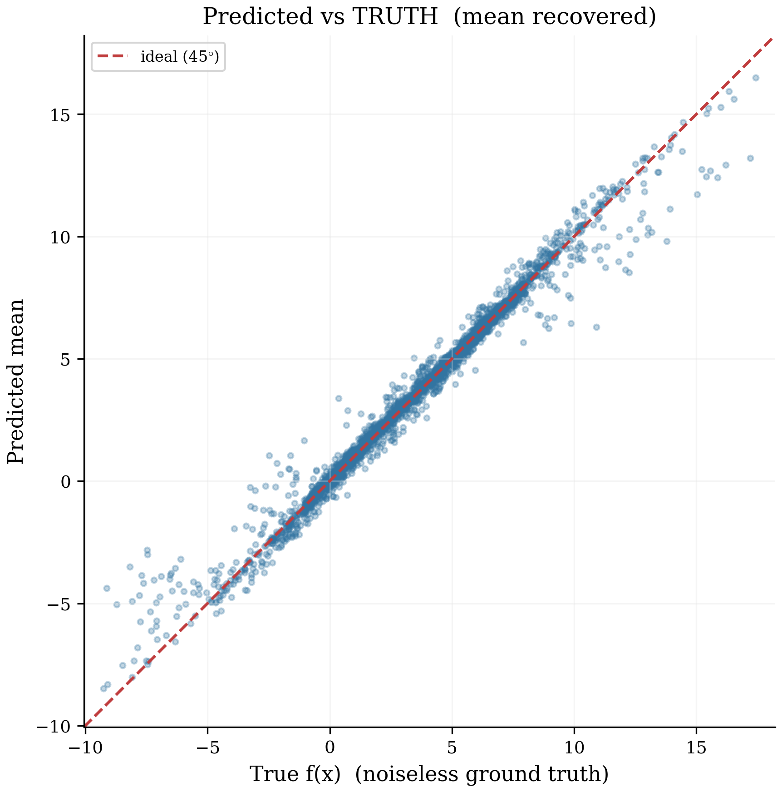

*Predicted vs the true f(x) — a tight line, R² = 0.98. The mean is recovered well;
the gap in the previous panel is purely noise.*

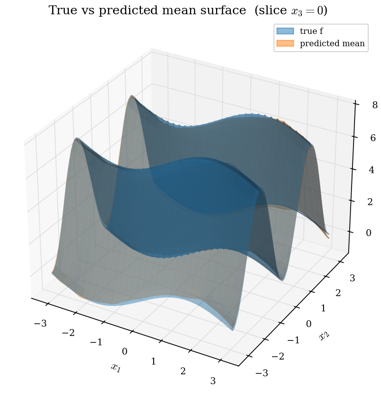

*True vs fitted mean surface (slice x₃ = 0). The true surface (blue) and the
predicted mean (orange) overlap so closely they blend.*

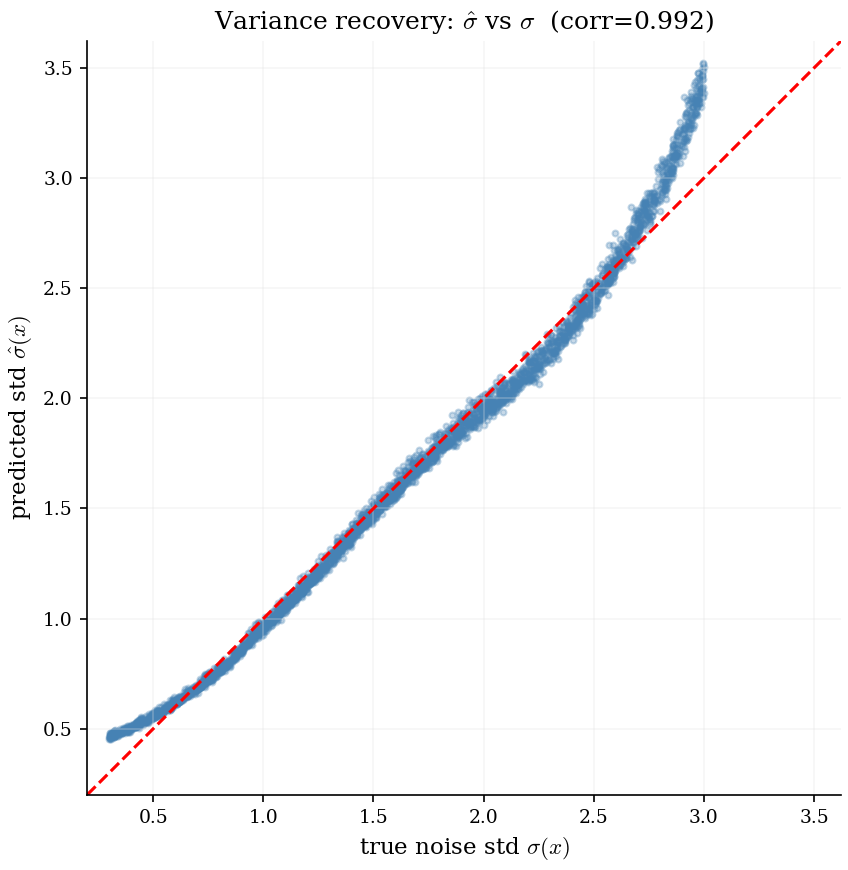

*Variance recovery — predicted noise std σ̂(x) vs the true σ(x), correlation 0.99.
The model does not just predict a value, it predicts a calibrated, input-dependent
uncertainty.*

---

## 5. Verifying the fit

A single call, `verify_model(...)`, runs the diagnostic workflow end-to-end and
confirms the fit is internally consistent before its Sobol indices are trusted:

```
[PASS] Sobol additivity: first+second+third+residual = 1.000 (target 1.000)
[PASS] Sobol bounds: indices in [0,1], total-order >= first-order
[PASS] Fit quality (test R^2): R^2 = 0.802
[PASS] Calibration (coverage): cov90=0.89 cov95=0.95 var(z)=1.07
[PASS] Input correlation: correlation_level = 'clean'
[info] Pure-interaction variables: x3: zero first-order, nonzero total-order
  => ALL CHECKS PASSED
```

The `[info]` line is the payoff: the toolbox has correctly identified x₃ as a
pure-interaction, hidden-variance variable — exactly the structure a single
feature-importance number would miss.

---

Reproduce: `python examples/run_ishigami_heteroscedastic.py`. See the
[User Guide](USER_GUIDE.md) for the full option reference and the
[benchmark](../benchmarks/README.md) to compare your own model.

*Documentation notice: Copyright (c) 2026 R. Sala. Draft, work in progress — not
covered by the source-code license. See [LICENSING.md](../LICENSING.md).*
